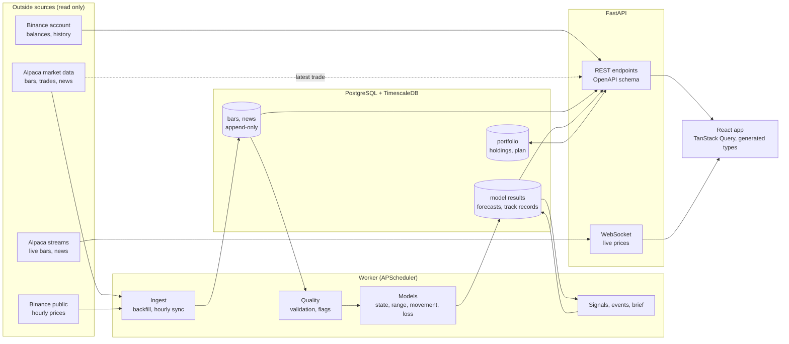

<div align="center">

# 📡 RADAR

**A read-only analyst for the assets you hold: what moved, how much it could move, and what your plan says to do next**

[](https://github.com/LouSens/RADAR/actions/workflows/ci.yml)
[](https://www.python.org/)
[](https://fastapi.tiangolo.com/)
[](https://www.timescale.com/)
[](https://www.sqlalchemy.org/)
[](https://scikit-learn.org/)
[](https://pytorch.org/)
[](https://huggingface.co/ProsusAI/finbert)
[](https://react.dev/)
[](https://www.typescriptlang.org/)
[](https://vitejs.dev/)
[](https://tailwindcss.com/)
[](https://docs.docker.com/compose/)
[](LICENSE)

</div>

RADAR follows a personal portfolio of Bitcoin, gold and US stocks held on Binance. It reads the account, explains what each holding is doing, measures how much it could move, and turns a plan of target shares into a short list of what to do with spare cash. It **never places a trade**: every connection it makes is a read, and the person acts on their own.

It is also a showcase of doing market data work honestly. Every claim on a screen carries its sample size and period, every model is checked on days it had not seen, and the things that were tested and did not work are written down instead of shipped.

---

## 📌 Contents

- [What it does](#-what-it-does)
- [What the research found](#-what-the-research-found)
- [System architecture](#-system-architecture)
- [The models](#-the-models)
- [Tech stack](#-tech-stack)
- [Getting started](#-getting-started)
- [Commands](#-commands)
- [Project layout](#-project-layout)
- [Rules the code keeps](#-rules-the-code-keeps)
- [Testing and CI](#-testing-and-ci)
- [Notebooks](#-notebooks)
- [Documentation](#-documentation)
- [Limits](#-limits)

## 🎯 What it does

| Area | What you get |
|---|---|
| **Your account** | Holdings read from Binance by themselves every few minutes (spot, funding, Earn, tokenised stocks), valued with Binance's own total. Nothing to type. |
| **What to do now** | Target shares you set yourself (for example 25% US stocks, 20% gold, 9% Bitcoin, the rest cash). Cash over the plan is split between what is short, each purchase as a ladder of prices worked out from the price **now**, with how that ladder did in past months. |
| **Your trades** | Rebuilt from Binance history: what each coin cost you, what you made or lost, whether trading beat simply holding, and whether you tend to buy near the top of the week. |
| **Check before you buy** | Where a coin sits in its range over a day, week, month, quarter and year. A reading, not a recommendation. |
| **Each market** | A live price chart from one day to all history, the market's state (calm, normal, turbulent), a range of prices ahead from 10,000 simulated futures, the expected size of a day's movement, and a loss limit with a count of how often it was broken. |
| **Where the risk sits** | Share of the money against share of the risk, how holdings move together, the value range ahead, and what paying in regularly leads to. |
| **News** | Headlines for each market with tone scored by a fine-tuned FinBERT, shown with its measured accuracy. Tone drives no forecast and no alert. |
| **Signals and calendar** | Changes of market state and abnormally large moves, each with its track record; dates of Fed decisions, jobs and inflation reports with how markets moved around past ones. |
| **Today in brief** | A short generated summary that opens with the price now and what there is to do. A test guarantees every number in it comes from stored data. |

## 🔬 What the research found

Every test was written down with its pass mark **before** it was run (`docs/DECISIONS.md`), and each model was first shown to find a planted pattern before its "no" was believed.

| Question | Result |
|---|---|
| Can anything tested call the direction of the next move? | **No.** RSI, moving averages, support and resistance, fair value gaps, order blocks, funding rates, positioning, trees, logistic regression and an LSTM: none passed. No "buy now" or "sell now" is built. |
| Can the **size** of the next move be forecast? | **Yes.** A regression on the last day, week and month of movement had the lowest error in 6 of 6 market-and-horizon comparisons. |
| Do loss limits hold as often as they say? | **Mostly.** 35 of 36 limits passed their test after allowing for testing many at once. |
| Does news tone improve the movement forecast? | **No**, in 12 of 12 comparisons. News is shown, not used. |
| Does waiting for a dip within the month get a better price? | **No.** It paid 0.2 to 0.8% more on average. |
| Are coins near their lows a better buy than coins near their highs? | **No.** Across 617 Binance coins, the low ones did worse. No screener is built. |
| Does the fine-tuned tone model beat the general one? | **Yes.** 61% against 52% right on 700 unseen headlines, a gap too large to be luck. Still modest on any single headline. |

What survives is unglamorous: how much you hold decides the outcome, movement size is forecastable, and paying in on a schedule beat every cleverer rule tried.

## 🏗 System architecture



- **One direction of flow.** Raw bars and news are append-only. Cleaning and every model write to their own tables, so any figure can be traced back to the data it came from.
- **The worker** runs the hourly sync and then each model in order, a few minutes apart. A job that starts late still runs.
- **The API** only reads stored results, plus two live reads: the Binance account (when the stored copy is more than five minutes old) and the latest trade for the prices in "What to do now".
- **The frontend's API types are generated** from the backend's OpenAPI schema, so the two cannot drift apart.

## 🧠 The models

| Model | Method | How it is checked |
|---|---|---|
| Market state | Hidden Markov model, three states, on daily return and intraday movement. Filtered probabilities only, never smoothed. | Walk-forward: refit, label the next 63 unseen days, repeat. Rougher states must be followed by larger moves. |
| Range ahead | Monte Carlo, 10,000 paths, drawing real past returns from the pool of each state. Reproducible from a stored seed. | Every past day replayed on what was known then; coverage of the 50, 80 and 95% ranges; adaptive conformal adjustment. |
| Size of movement | HAR regression (last day, week, month), beside gradient-boosted trees, "yesterday repeated" and a state average. | QLIKE loss on unseen days and a Diebold-Mariano test against each rival. |
| Loss limit | Value at Risk and expected shortfall three ways: historical, scaled to the forecast, and from the simulation. | Kupiec coverage and clustering tests, corrected for multiple comparisons. |
| Portfolio risk | Ledoit-Wolf covariance, risk shares, block bootstrap of the value ahead. | Walk-forward coverage beside a bell curve it did not beat, which the screen says. |
| News tone | FinBERT fine-tuned on 1,800 labelled headlines, split by time with near-copies removed. | A held-out test fixed in advance, McNemar's test, and the share of labels that came out backwards. |
| Signals | Change of state and abnormal hourly moves (5 times the usual size). | Replayed walk-forward; a track record per kind, for direction and for size. |
| Trading record | Average-cost ledger reconciled to the real balance; round trips; trading against holding. | Tested on invented traders whose habits are known. |

## 🧰 Tech stack

| Layer | Tools |
|---|---|
| Backend | Python 3.12, FastAPI, Pydantic, SQLAlchemy 2, Alembic, APScheduler, structlog |
| Data and models | pandas, NumPy, scikit-learn, hmmlearn, statsmodels, PyTorch, Transformers |
| Database | PostgreSQL 17 with TimescaleDB |
| Frontend | React 19, TypeScript (strict), Vite, Tailwind CSS 4, TanStack Query, lightweight-charts |
| Tooling | uv, ruff, mypy `--strict`, pytest, ESLint, Vitest, GitHub Actions, Docker Compose |

## 🚀 Getting started

You need Docker, [uv](https://docs.astral.sh/uv/), Node 24, and an [Alpaca](https://alpaca.markets/) **paper** account for market data. A Binance key is optional and must be **read-only**.

```bash
git clone https://github.com/LouSens/RADAR.git
cd RADAR
cp .env.example .env
```

Fill in `.env` with your own keys. It is gitignored and is never read by anything but the app.

```bash
uv sync
npm --prefix frontend ci
make up
make migrate
make backfill
```

The first backfill takes about 17 minutes. Then fit the models once:

```bash
uv run radar regime
uv run radar simulate
uv run radar volatility
uv run radar risk
uv run radar signals
uv run radar brief
```

Open <http://localhost:8080>. From here the worker keeps everything up to date by itself.

The news tone model needs the optional extra and runs on the host, not in Docker:

```bash
uv sync --extra nlp
uv run radar sentiment
```

## ⌨ Commands

| Command | What it does |
|---|---|
| `make up` / `make down` | Start or stop the database, API, worker and web app |
| `make test` | Backend pytest and frontend Vitest |
| `make lint` | ruff, mypy, ESLint and the TypeScript check |
| `uv run radar backfill` | Fetch history for every asset (seconds after the first time) |
| `uv run radar portfolio` | Read the account again and recompute the analysis |
| `uv run radar record` | Rebuild the trading record from Binance history |
| `uv run radar outside-hours` | Read hourly prices from a second source where an asset names one |
| `uv run radar openapi` | Rewrite the API schema; then `npm --prefix frontend run gen:api` |
| `uv run python backend/scripts/build_notebooks.py` | Rebuild the notebooks from `notebooks/src/` |

The full list is in [`CLAUDE.md`](CLAUDE.md).

## 🗂 Project layout

```
backend/
  src/radar/
    providers/     Alpaca and Binance clients, rate limiting, retries
    ingest/        backfill and live ingestion
    quality/       validation, cleaning, data quality reports
    features/      returns, movement, calendars, alignment
    models/        state, simulation, movement, loss, tone, portfolio, ledger
    analytics/     event studies, buying rules, trading habits, track records
    signals/       detection and scoring
    brief/         the daily brief and its grounding check
    pipelines/     orchestration of the steps above
    api/           FastAPI routers and schemas
    db/            SQLAlchemy models and Alembic migrations
  tests/           mirrors src/
frontend/
  src/             pages, components, generated API types
notebooks/         seven notebooks; sources in notebooks/src/
docs/              specification, decisions log, audits
```

## 🔒 Rules the code keeps

Each of these is enforced by a test, not by convention.

- **No trading.** No order, transfer or account-changing endpoint is imported, called or wrapped. The Binance client may only call a fixed list of read endpoints.
- **One market data host.** The Alpaca client rejects any base URL other than `data.alpaca.markets`.
- **No lookahead.** A value shown for a time uses only data from that time or before. Every model has a test that rewrites the future and checks the past does not change.
- **Time-ordered evaluation only.** Walk-forward or expanding windows. Time series are never shuffled.
- **Idempotent ingestion.** Running a job again for the same window gives the same rows.
- **Numbers in generated text come from data.** The brief may only contain numbers present in its input.
- **No secrets in the repository.** Keys live in `.env`. Fixtures are synthetic.

## ✅ Testing and CI

About 700 backend tests and 130 frontend tests run on every pull request, with ruff, mypy in strict mode, ESLint and the TypeScript check. Provider tests use recorded or synthetic fixtures and never call a live service.

```bash
make up
make test
make lint
```

## 📓 Notebooks

A notebook is where an idea is tried. What holds up becomes tested code and a screen; the notebook stays as the explanation. Every portfolio and trader in them is made up.

| Notebook | Question |
|---|---|
| `01_exploration` | What data is there, and how clean is it? |
| `02_state_and_range` | What state is a market in, and what range of prices is plausible? |
| `03_swings_and_loss` | How much will it move, and how bad could a bad day be? |
| `04_news` | Can the tone of headlines be scored, and how well? |
| `05_portfolio_and_paying_in` | Where does a mix's risk sit, and what does paying in regularly lead to? |
| `06_trading_record` | What do a person's own trades say about how they trade? |
| `07_what_we_tested` | What was tried and did not work, and why? |

## 📚 Documentation

| Document | What is in it |
|---|---|
| [`docs/WHAT_RADAR_IS.md`](docs/WHAT_RADAR_IS.md) | The whole project explained from zero |
| [`docs/PROJECT_SPEC.md`](docs/PROJECT_SPEC.md) | The specification and the build plan |
| [`docs/DECISIONS.md`](docs/DECISIONS.md) | Every design decision and test, with its reason and result |
| [`docs/AUDIT.md`](docs/AUDIT.md) | An audit of the concepts, methods and flaws |
| [`docs/DATA_AUDIT.md`](docs/DATA_AUDIT.md) | Measured facts about the data sources |

## ⚠ Limits

- Bitcoin and gold have prices from 2021 only, so their models have seen few market cycles.
- Stock prices are 15 minutes delayed, and a tokenised stock on Binance is priced by the fund it tracks.
- The headline labels were written by an AI model, not a person.
- Everything is drawn from the past few years. A future unlike them is not in any range shown.
- RADAR is an analytics tool for one person's own use. It is not financial advice.

## 📄 License

[MIT](LICENSE)
